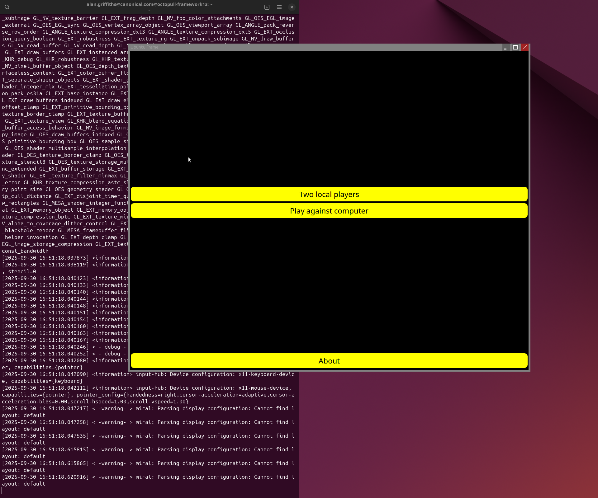
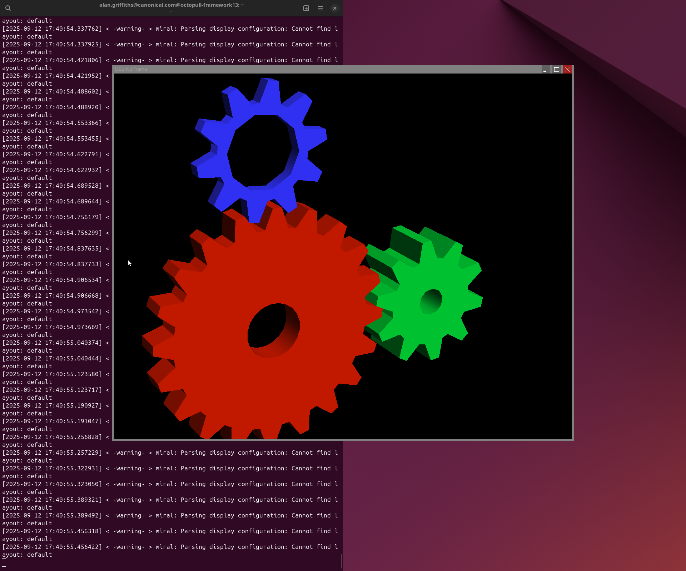

(packaging-an-application-iot-gui)=
# Packaging an application as an IoT GUI

[Ubuntu Frame](https://mir-server.io/ubuntu-frame/) is the foundation for embedded displays. It provides a reliable, secure and easy way to embed your applications into a kiosk-style, IoT device, or digital signage solution. With Ubuntu Frame, the graphic application you choose or design gets a fullscreen window, a dedicated set of windows behaviours, input from touch, keyboard and mouse without needing to deal with the specific hardware, on-screen keyboard, and more.

Together with [Ubuntu Core](https://ubuntu.com/core), Ubuntu Frame provides all the infrastructure you need to securely deploy and maintain graphic applications on edge devices. And while Ubuntu Core maximizes performance and security of your apps, Ubuntu Frame is compatible with any Linux operating system that supports snaps.

This developer guide will show you how to deploy your graphic application that supports the [Wayland protocol](https://wayland.freedesktop.org/docs/html/) to work with Ubuntu Frame and Ubuntu Core. This guide is for developers looking to build kiosks, digital signage solutions, infotainment systems, IoT devices or any other applications that require a graphic interface running on a screen.

We will cover:

1. Setting up the tools and environment required to package and deploy your application on your desktop
1. Testing if an application works with Ubuntu Frame on your desktop
1. Troubleshooting some common issues
1. Packaging the app as a snap and testing whether the snap works on your desktop
1. Packaging the snap for an IoT device and testing it on the device

If you want to learn how to install pre-built applications such as [wpe-webkit-mir-kiosk](https://snapcraft.io/wpe-webkit-mir-kiosk), [mir-kiosk-kodi](https://snapcraft.io/mir-kiosk-kodi/), or [Scummvm](https://snapcraft.io/scummvm), follow their official installation and configuration guides.

```{note}
This guide will not cover how to build an application using a toolkit that supports Wayland (there are many). We will also not cover how to upload your snap to the snap store, nor building custom Ubuntu Core images with pre-configured snaps. That is documented on [snapcraft.io/docs](https://snapcraft.io/docs).

If you are migrating a Windows application, redirect to {ref}`this guide <migrating-a-windows-application>` for instructions.
```

If you are new to Ubuntu Core, we recommend reading our {doc}`getting started document <core:tutorials/build-your-first-image/index>`. If you want to learn about building custom Ubuntu Core images, you could find information on the [snapcraft docs](https://snapcraft.io/docs/the-gadget-snap).

## Requirements

Developers use different tools and processes to build their graphic applications. For the purpose of this guide, we assume that you have an application that supports the Wayland protocol that you can test on your Linux-based desktop.

It is possible to work in a container or on a different computer (if snapd and X forwarding work well enough). But those options are outside the current scope.

For some of the later steps, you will need an [Ubuntu One account](https://login.ubuntu.com/). This will let you enable `remote-build` on your [Launchpad](https://launchpad.net/) account and publish on the [Snap Store](https://snapcraft.io).

## Setting up your test environment

**Ubuntu Frame** provides a tool for developers to simulate how their end application will look and respond in your development environment. So, you don’t need to work directly on your target device to perform the first design and usability iterations.

Open a terminal window and type:

```
sudo snap install ubuntu-frame --channel=24
```

```{tip}
For Ubuntu Frame there are various channels corresponding to the snap bases that snaps are based on, in this case we use `--channel=24` which corresponds to `base: core24` which in turn refers to Ubuntu 24.04LTS.
```

**Frame-it** is a command-line utility for running snaps with Ubuntu Frame and is useful for testing on your development machine.

```
sudo snap install frame-it --classic
```

**Snapcraft** is a command-line utility for building snaps. This software allows users to build their own applications or software packages, and then publish them to the [Snap Store](https://snapcraft.io).

In the same terminal window type:

```
sudo snap install snapcraft --classic
```

If you don't have git installed, now is a good time to install it (on Ubuntu, use the command `sudo apt install git`).

## Checking your application works with Ubuntu Frame

There can be problems with both getting your application to work well with Ubuntu Frame and getting your application to work in a snap. To avoid confusion, we recommend first testing your application with Ubuntu Frame before packaging it as a snap. In this section, you will test your application, explore some common issues you might run into, and learn how to fix them.

### Testing your application with Frame-it

You can use Electron, Flutter, Qt, or any other toolkit or programming language to develop your graphic application. There is no sole path for checking all of them. Instead, this guide will use some example applications using GTK, QT, and SDL2.

The examples used here are game applications, such as Mastermind, Neverputt, and Bomber. We’ve chosen these applications as they are easily installable and are designed to work without a full desktop session. But they can be replaced by your kiosk application, industrial GUI, smart fridge GUI, digital sign and more.

The first step is to download the application and execute it:

`````{tab-set}
````{tab-item} Flutter
:sync: flutter
```
snap install flutter  # or follow https://docs.flutter.dev/get-started/install
git clone https://github.com/flutter/flutter.git --branch stable --depth 1
cd flutter/examples/texture
frame-it flutter run
```
````

````{tab-item} GTK3
:sync: gtk3
```
sudo apt install gnome-mastermind
frame-it gnome-mastermind
```
````

````{tab-item} SDL2
:sync: sdl2
```
sudo apt install neverputt
frame-it neverputt
```
````

````{tab-item} Qt5
:sync: qt5
```
sudo apt install bomber
frame-it bomber
```
````

````{tab-item} Qt6
:sync: qt6
```
sudo apt install explosive-c4 qt6-wayland
frame-it explosive-c4
```
````

````{tab-item} X11
:sync: x11
```
sudo apt install mesa-utils mir-x11-kiosk
frame-it.x11 glxgears
```
````

````{tab-item} Electron
:sync: electron
```
git clone https://github.com/electron/electron-quick-start.git
cd electron-quick-start
npm install
frame-it npm start -- --enable-features=UseOzonePlatform --ozone-platform=wayland
```
````
`````

Now Ubuntu Frame's window should contain the application window. It should look like this:

`````{tab-set}
````{tab-item} Flutter
:sync: flutter


If your application doesn’t appear in the Ubuntu Frame window or look right at this stage, then this is the time to work out the fix, before packaging as a snap.

Close the application window (`Ctrl-Q`).

Before continuing to the next section, return to your previous working directory:

    cd -
````

````{tab-item} GTK3
:sync: gtk3


If your application doesn’t appear in the Ubuntu Frame window or look right at this stage, then this is the time to work out the fix, before packaging as a snap.

Close Mastermind (`Ctrl-Q`).
````

````{tab-item} SDL2
:sync: sdl2


If your application doesn’t appear in the Ubuntu Frame window or look right at this stage, then this is the time to work out the fix, before packaging as a snap.

Close Neverputt (`Esc`)
````

````{tab-item} Qt5
:sync: qt5


If your application doesn’t appear in the Ubuntu Frame window or look right at this stage, then this is the time to work out the fix, before packaging as a snap.

Close the Bomber (`Ctrl-Q`).
````

````{tab-item} Qt6
:sync: qt6


If your application doesn’t appear in the Ubuntu Frame window or look right at this stage, then this is the time to work out the fix, before packaging as a snap.

Close the window (`Alt-F4`).
````

````{tab-item} X11
:sync: x11



If your application doesn’t appear in the Ubuntu Frame window or look right at this stage, then this is the time to work out the fix, before packaging as a snap.

Close glxgears (`Esc`)
````

````{tab-item} Electron
:sync: electron


If your application doesn’t appear in the Ubuntu Frame window or look right at this stage, then this is the time to work out the fix, before packaging as a snap.

Close "Hello World!" (`Ctrl-Q`).

Before continuing to the next section, return to your previous working directory:

    cd -
````
`````

## Packaging your application as a Snap

Now that you know how to confirm that an application is working with Ubuntu Frame, the next step is to use snap packaging to prepare the application for use on an IoT device. As before, this section will show you how to package your application together with some issues you might find and their troubleshoot.

### Snap packaging for IoT graphics

For use with [Ubuntu Core](https://ubuntu.com/core), your application needs to be packaged as a snap. This will also allow you to leverage Over The Air updates, automatic rollbacks, delta updates, update semantic channels, and more. If you don't use Ubuntu Core, but instead another form of Linux, we recommend you use snaps to get many of these advantages.

There's a lot of information about [packaging snaps online](https://ubuntu.com/tutorials/create-your-first-snap), and the purpose here is not to teach about the {doc}`snapcraft <snapcraft:tutorials/craft-a-snap>` packaging tool or the [Snap Store](https://snapcraft.io/store). We will, instead, focus on the things that are special to IoT graphics.

Much of what you find online about packaging GUI applications as a snap refers to packaging for desktop. Some of that doesn't apply to IoT as Ubuntu Core and Ubuntu Server do not include everything a desktop installation does and the snaps need to run as {doc}`daemons <snapcraft:reference/project-file/snapcraft-yaml>` (background services) instead of being launched in a user session. In particular, for the time being, you should ignore various Snapcraft {doc}`extensions <snapcraft:how-to/extensions/index>` that help writing snap recipes that integrate with the desktop environment (e.g. using the correct theme) as they are not tested for use with Ubuntu Frame on Ubuntu Core.

Writing snap recipes without these extensions is not difficult as we'll illustrate for each of the example programs used in the previous section.

First, you will clone a repository containing a generic Snapcraft recipe for IoT graphics.

In the *same terminal window* you opened at the start of the last section, type:

```
git clone https://github.com/canonical/iot-example-graphical-snap.git
cd iot-example-graphical-snap
```

If you look in `snap/snapcraft.yaml`, you'll see a generic "snapcraft recipe" for an IoT graphics snap. This is where you will insert instructions for packaging your application. This is how the `.yaml` file looks like:


The customised snapcraft recipe for each example described in this guide (i.e. GTK, Qt and SDL2) is on a corresponding branch in this repository:

```
$ $ git branch --list --remotes origin/24/*
  origin/24/Electron-quick-start
  origin/24/Flutter-demo
  origin/24/GTK3-adventure
  origin/24/GTK3-mastermind
  origin/24/Qt5-bomber
  origin/24/Qt5-bomber-first-try
  origin/24/Qt6-example
  origin/24/SDL2-neverputt
  origin/24/main
  origin/24/native-glmark2
  origin/24/x11-glxgears
```

```{tip}
The "24" prefix refers to the snap bases that snaps are based on, in this case we use `24` for branches using to `base: core24` which in turn refers to Ubuntu 24.04LTS. (There are similar `22` and `20` collections.)
```

Once you have the customised snapcraft recipe, you can snap your example applications.

Switch to the example branch relevant to your application and use snapcraft to build the snap:

`````{tab-set}
````{tab-item} Flutter
:sync: flutter
```
git checkout 24/Flutter-demo
snapcraft pack
```
````

````{tab-item} GTK3
:sync: gtk3
```
git checkout 24/GTK3-mastermind
snapcraft pack
```
````
````{tab-item} SDL2
:sync: sdl2
```
git checkout 24/SDL2-neverputt
snapcraft pack
```
````
````{tab-item} Qt5
:sync: qt5
```
git checkout 24/Qt5-bomber
snapcraft pack
```
````

````{tab-item} Qt6
:sync: qt6
```
git checkout 24/Qt6-example
snapcraft pack
```
````

````{tab-item} X11
:sync: x11
```
git checkout 24/x11-glxgears
snapcraft pack
```
````

````{tab-item} Electron
:sync: electron
```
git checkout 24/Electron-quick-start
snapcraft pack
```
````
`````

Snapcraft is the packaging tool used to create snaps. We are not going to explore all its options here but, to avoid confusion, note that when you first run snapcraft, you will be asked "Support for 'multipass' needs to be set up. Would you like to do it now? \[y/N\]:", answer "yes".

After a few minutes, the snap will be built with a message similar to:

```
Packed iot-example-graphical-snap_0+git.4c03a17_amd64.snap
```

Here, `iot-example-graphical-snap_0+git.4c03a17_amd64.snap` is your snap file name.

You can then install and run the snap:

```
sudo snap install --dangerous <snap-file>
frame-it iot-example-graphical-snap
```
Replace <snap-file> with the name of the snap file.

The first time you run your snap with Ubuntu Frame installed, you are likely to see a warning:


`````{tab-set}
````{tab-item} Flutter
:sync: flutter
```
...
WARNING: wayland interface not connected! Please run: /snap/iot-example-graphical-snap/current/bin/setup.sh

(flutterdemo:1072106): Gtk-WARNING **: 17:15:05.765: cannot open display:
[2024-11-20 17:15:05.768233] < - debug - > mirserver: Handling Terminated from pid=1072004
[2024-11-20 17:15:05.768477] < -warning- > mirserver: wl_surface@12 destroyed before associated role
```
````

````{tab-item} GTK3
:sync: gtk3
```
...
WARNING: wayland interface not connected! Please run: /snap/iot-example-graphical-snap/current/bin/setup.sh

(gnome-mastermind:1029616): Gtk-WARNING **: 15:43:32.167: cannot open display:
[2024-11-20 15:43:32.169302] < - debug - > mirserver: Handling Terminated from pid=1029515
[2024-11-20 15:43:32.169484] < -warning- > mirserver: wl_surface@12 destroyed before associated role
```
````
````{tab-item} SDL2
:sync: sdl2
```
$ snap run iot-example-graphical-snap
WARNING: wayland interface not connected! Please run: /snap/iot-example-graphical-snap/current/bin/setup.sh
WARNING: hardware-observe interface not connected! Please run: /snap/iot-example-graphical-snap/current/bin/setup.sh
WARNING: joystick interface not connected! Please run: /snap/iot-example-graphical-snap/current/bin/setup.sh
Failure to initialize SDL (wayland not available)
[2024-11-20 16:56:32.762903] < - debug - > mirserver: Handling Terminated from pid=1055087
[2024-11-20 16:56:32.763099] < -warning- > mirserver: wl_surface@12 destroyed before associated role
```
````
````{tab-item} Qt5
:sync: qt5
```
...
WARNING: wayland interface not connected! Please run: /snap/iot-example-graphical-snap/current/bin/setup.sh
Failed to create wl_display (Permission denied)
Failed to create wl_display (Permission denied)
qt.qpa.plugin: Could not load the Qt platform plugin "wayland" in "/snap/iot-example-graphical-snap/x65/usr/lib/x86_64-linux-gnu/qt5/plugins/platforms/" even though it was found.
This application failed to start because no Qt platform plugin could be initialized. Reinstalling the application may fix this problem.

Available platform plugins are: eglfs (from /snap/iot-example-graphical-snap/x65/usr/lib/x86_64-linux-gnu/qt5/plugins/platforms/), linuxfb (from /snap/iot-example-graphical-snap/x65/usr/lib/x86_64-linux-gnu/qt5/plugins/platforms/), minimal (from /snap/iot-example-graphical-snap/x65/usr/lib/x86_64-linux-gnu/qt5/plugins/platforms/), minimalegl (from /snap/iot-example-graphical-snap/x65/usr/lib/x86_64-linux-gnu/qt5/plugins/platforms/), offscreen (from /snap/iot-example-graphical-snap/x65/usr/lib/x86_64-linux-gnu/qt5/plugins/platforms/), vnc (from /snap/iot-example-graphical-snap/x65/usr/lib/x86_64-linux-gnu/qt5/plugins/platforms/), wayland-egl (from /snap/iot-example-graphical-snap/x65/usr/lib/x86_64-linux-gnu/qt5/plugins/platforms/), wayland (from /snap/iot-example-graphical-snap/x65/usr/lib/x86_64-linux-gnu/qt5/plugins/platforms/), wayland-xcomposite-egl (from /snap/iot-example-graphical-snap/x65/usr/lib/x86_64-linux-gnu/qt5/plugins/platforms/), wayland-xcomposite-glx (from /snap/iot-example-graphical-snap/x65/usr/lib/x86_64-linux-gnu/qt5/plugins/platforms/), xcb (from /snap/iot-example-graphical-snap/x65/usr/lib/x86_64-linux-gnu/qt5/plugins/platforms/), eglfs, linuxfb, minimal, minimalegl, offscreen, vnc, wayland-egl, wayland, wayland-xcomposite-egl, wayland-xcomposite-glx, xcb.

[2024-11-20 16:17:25.832791] < - debug - > mirserver: Handling Terminated from pid=1042144
[2024-11-20 16:17:25.832961] < -warning- > mirserver: wl_surface@12 destroyed before associated role
```

````

````{tab-item} Qt6
:sync: qt6
```
...
WARNING: wayland interface not connected! Please run: /snap/iot-example-graphical-snap/current/bin/setup.sh
Failed to create wl_display (Permission denied)
qt.qpa.plugin: Could not load the Qt platform plugin "wayland" in "/snap/iot-example-graphical-snap/x1/usr/lib/x86_64-linux-gnu/qt6/plugins/platforms/" even though it was found.
This application failed to start because no Qt platform plugin could be initialized. Reinstalling the application may fix this problem.

Available platform plugins are: eglfs, linuxfb, minimal, minimalegl, offscreen, vkkhrdisplay, wayland-egl, wayland, xcb.

/snap/frame-it/x8/frame-it: line 35: 102885 Aborted                 (core dumped) WAYLAND_DISPLAY="${wayland_display}" SDL_VIDEODRIVER=wayland QT_QPA_PLATFORM=wayland GDK_BACKEND=wayland $@
[2025-09-30 16:56:47.992021] < - debug - > mirserver: Handling Terminated from pid=102741
```

````

````{tab-item} X11
:sync: x11
```
...
ERROR: ./src/server/graphics/default_configuration.cpp(198): Throw in function virtual const std::vector<std::shared_ptr<mir::graphics::DisplayPlatform> >& mir::DefaultServerConfiguration::the_display_platforms()
Dynamic exception type: boost::wrapexcept<std::runtime_error>
std::exception::what: Exception while creating graphics platform
ERROR: ./src/platforms/wayland/wayland_display.cpp(65): Throw in function wl_display* mir::platform::wayland::connection(const mir::options::Option&)
Dynamic exception type: boost::wrapexcept<std::runtime_error>
std::exception::what: Failed to connect to Wayland display '/run/user/1000/wayland-2'

/tmp/tmp.rh9HQmjZ8T CLOSE_WRITE,CLOSE
Error: couldn't open display :
/snap/iot-example-graphical-snap/x68/usr/bin/mir-x11-kiosk-launch: 20: kill: No such process

[2024-11-20 17:46:45.733516] < - debug - > mirserver: Handling Terminated from pid=1085119
[2024-11-20 17:46:45.733721] < -warning- > mirserver: wl_surface@12 destroyed before associated role
```
````

````{tab-item} Electron
:sync: electron
```
WARNING: wayland interface not connected! Please run: /snap/iot-example-graphical-snap/current/bin/setup.sh
[231190:0624/162014.069287:ERROR:wayland_connection.cc(209)] Failed to connect to Wayland display
[231190:0624/162014.069317:ERROR:ozone_platform_wayland.cc(226)] Failed to initialize Wayland platform
[231190:0624/162014.069322:ERROR:env.cc(226)] The platform failed to initialize.  Exiting.
The futex facility returned an unexpected error code.
```
````
`````

This warning or exception about failure to connect to the Wayland interface is the key to the problem and comes from one of the scripts in the generic recipe. While developing your snap (that is, until your snap is uploaded to the store and any necessary “store assertions” granted), connecting any “interfaces” your snap uses needs to be done manually. As the message suggests, there’s a helper script for this. Run it and try again:

```
/snap/iot-example-graphical-snap/current/bin/setup.sh
frame-it iot-example-graphical-snap
```

Now Frame’s window should contain the app. 

`````{tab-set}
````{tab-item} Flutter
:sync: flutter


Close the application (`Ctrl-Q`). Your application has been successfully snapped.
````

````{tab-item} GTK3
:sync: gtk3


Close the application (`Ctrl-Q`). Your application has been successfully snapped.
````

````{tab-item} SDL2
:sync: sdl2


Close Neverputt.
````

````{tab-item} Qt5
:sync: qt5


Close the application (`Ctrl-Q`). Your application has been successfully snapped.
````

````{tab-item} Qt6
:sync: qt6


Close the window (`Alt-F4`). Your application has been successfully snapped.
````

````{tab-item} X11
:sync: x11


Close the application (`Esc`). Your application has been successfully snapped.
````

````{tab-item} Electron
:sync: electron


Close the application (`Ctrl-Q`). Your application has been successfully snapped.
````
`````

### Packaging your own application

When packaging an application there are many issues to address: what needs to be in the snap, how does the runtime environment need to be configured and what interfaces are needed.

You might get some inspiration from the examples we’ve given. You can see the customisation used in each example using git diff, for example:

```
git diff 24/main 24/x11-glxgears
```

## Building for and installing on a device

So far you explored the process for testing if your snapped application will work on Ubuntu Frame only using your desktop. While this accelerates the development process, you still need to consider the final board for your edge device. A lot of edge devices don’t use the amd64 architecture that is typical of development machines. Therefore, in this section, you will see how to build for and install on a device if your device uses a different architecture.

### Leveraging Snapcraft remote build tool

The simplest way to build your snap for other architectures is:

```
snapcraft remote-build
```

This uses the Launchpad build farm to build each of the architectures supported by the snap. This requires you to have a Launchpad account and to be okay uploading your snap source to a public location.

Once the build is complete, you can scp the .snap file to your IoT device and install using --dangerous.

### Installing on a device

For the sake of this guide, we are using a VM set up using the approach described in[ Ubuntu Core: Preparing a virtual machine with graphics support](https://ubuntu.com/tutorials/ubuntu-core-preparing-a-virtual-machine-with-graphics-support). Apart from the address used for scp and ssh this is the same as any other device and makes showing screenshots easier.

```
scp -P 10022 *.snap <username>@localhost:~
ssh -p 10022 <username>@localhost
snap install ubuntu-frame --channel 24
snap install --dangerous *.snap
```

`````{tab-set}
````{tab-item} Flutter
:sync: flutter

````

````{tab-item} GTK3
:sync: gtk3

````

````{tab-item} SDL2
:sync: sdl2

````

````{tab-item} Qt5
:sync: qt5

````

````{tab-item} Qt6
:sync: qt6

````

````{tab-item} X11
:sync: x11

````

````{tab-item} Electron
:sync: electron

````
`````

## Conclusion

From testing to deployment, this guide shows you how to use Ubuntu Frame to deploy your graphic applications. It covers topics as setting up the tools and environment on your desktop, testing if an application works with Ubuntu Frame, and packaging the application as a snap for an IoT device. It also included some issues you can encounter working with your applications and how to troubleshoot them.

We have also shown all the steps needed to get your snap running on a device. The rest of your development process is the same as for any other snap: uploading the snap to the store and installing on devices from there. There are just a few parting things to note:

Now that the Snap interfaces are configured, the application will automatically start when the system (re)starts.

Once you’ve uploaded the snap to the store, you can [request store assertions](https://forum.snapcraft.io/c/store-requests/19) to auto-connect any required interfaces. Alternatively, if you are building a Snap Appliance, then you can connect the interfaces in the “Gadget Snap”.

## Learn more

For more information about Ubuntu Frame please visit our [website](https://mir-server.io/ubuntu-frame).

You may also consider reading the following materials:

- {ref}`make-a-secure-ubuntu-web-kiosk`.
- How to {ref}`enable on-screen keyboard support <ubuntu-frame-osk-documentation>` in Ubuntu Frame.

Need help in getting to market? [Contact us](https://ubuntu.com/internet-of-things/digital-signage#get-in-touch)
